# ⚙️ DevTinder

The backend service for **DevTinder**, a developer matchmaking and chat platform.  
Built using **Node.js**, **Express**, **MongoDB**, and **Socket.IO**, it handles authentication, user management, chat, and real-time communication.

📁 **Backend Repo:** [https://github.com/Aneesh-Khanna/DevTinder](https://github.com/Aneesh-Khanna/DevTinder)  
🖥️ **Frontend Repo:** [https://github.com/Aneesh-Khanna/DevTinderWeb](https://github.com/Aneesh-Khanna/DevTinderWeb)  
☁️ **Hosted On:** Render (kept alive with UptimeRobot)

---

## 🧩 Microservice Architecture

This backend works as a microservice communicating with the React frontend through REST APIs and WebSockets.

| Layer    | Description                                        | Stack              |
| -------- | -------------------------------------------------- | ------------------ |
| API      | Handles routes and logic for users, auth, and chat | Express.js         |
| Database | Stores users, profiles, and chat messages          | MongoDB (Mongoose) |
| Auth     | Validates JWT tokens for secure access             | JWT + Bcrypt       |
| Realtime | Manages live chat connections                      | Socket.IO          |

---

## 🚀 Features

- 🔐 **Signup / Login / Logout** APIs
- 🧾 **JWT Authentication** with middleware validation
- ✅ **Verified User System**
- 🚫 **Unverified users cannot log in**
- 🧱 **Profile APIs** — view, edit, and change password
- 🧩 `/profile/password` endpoint for secure password updates
- 💬 **Chat APIs** with real-time Socket.IO events
- ⚠️ **Message validation** (only friends can chat)
- 🔄 **Error handling** via centralized middleware
- 🔔 Emits `errorMsg` socket event for unauthorized access
- ⚙️ **Environment configuration** via `.env`
- 🕒 **UptimeRobot integration** for always-on backend

---

## 🧠 API Overview

---

## 🧩 authRouter

| Endpoint      | Method | Description                                    |
| ------------- | ------ | ---------------------------------------------- |
| `/signup`     | POST   | Saves new user signup data to the database     |
| `/login`      | POST   | Authenticates user and returns JWT token       |
| `/logout`     | POST   | Logs out user and deletes token                |
| `/verify-otp` | POST   | Verifies the OTP entered by user during signup |
| `/resend-otp` | POST   | Resends OTP to user email for verification     |

---

## 👤 profileRouter

| Endpoint            | Method | Description                                                  |
| ------------------- | ------ | ------------------------------------------------------------ |
| `/profile/view`     | GET    | Fetches user’s profile details for display                   |
| `/profile/edit`     | PATCH  | Updates editable profile fields (about, skills, etc.)        |
| `/profile/password` | PATCH  | Updates user password (also serves as “Forget Password” API) |

---

## 🤝 connectionRequestRouter

| Endpoint                             | Method | Description                                             |
| ------------------------------------ | ------ | ------------------------------------------------------- |
| `/request/send/:status/:userId`      | POST   | Send a request to another user (`ignore` or `interest`) |
| `/request/review/:status/:requestId` | POST   | Accept or reject a received request                     |

---

## 👥 userRouter

| Endpoint                  | Method | Description                                          |
| ------------------------- | ------ | ---------------------------------------------------- |
| `/user/requests/received` | GET    | Fetch all pending incoming requests                  |
| `/user/connections`       | GET    | Fetch all accepted connections of the logged-in user |
| `/user/feed`              | GET    | Get list of other user profiles for browsing         |

---

## 💬 chatRouter

| Endpoint              | Method | Description                                               |
| --------------------- | ------ | --------------------------------------------------------- |
| `/chat/:targetUserId` | GET    | Fetch chat history between logged-in user and target user |

---

✅ **Status values:** `ignored`, `interested`, `accepted`, `rejected`

---

## 🔌 Socket.IO Events

| Event             | Description                             |
| ----------------- | --------------------------------------- |
| `connection`      | Triggered when user connects            |
| `send_message`    | When a user sends a message             |
| `receive_message` | Broadcasts message to recipient         |
| `errorMsg`        | Emits toast error for unauthorized chat |
| `disconnect`      | When user leaves                        |

---

## ⚙️ .env Example

```bash
PORT=3001
MONGO_URI=mongodb+srv://your_connection_string
JWT_SECRET=your_secret_key
```

---

## 📦 Run Locally

```bash
git clone https://github.com/Aneesh-Khanna/DevTinder
cd DevTinder
npm install
npm run dev
```

---

## 📸 Screenshots

### 🔐 Authentication

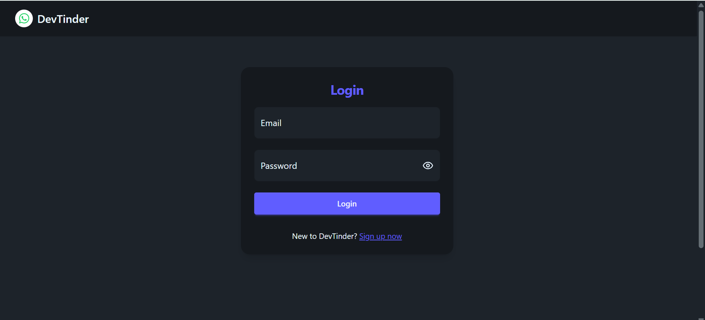
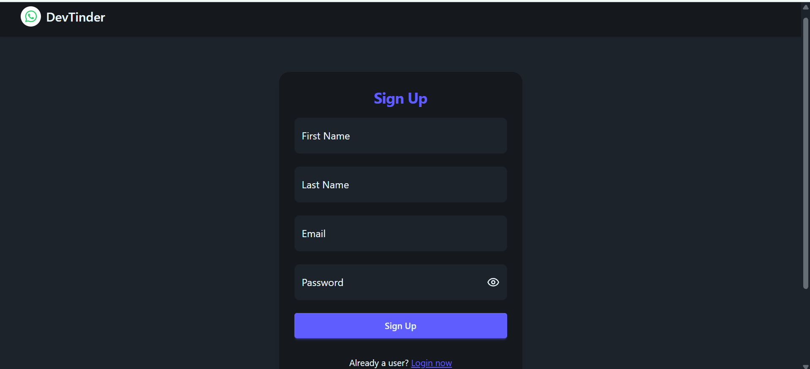
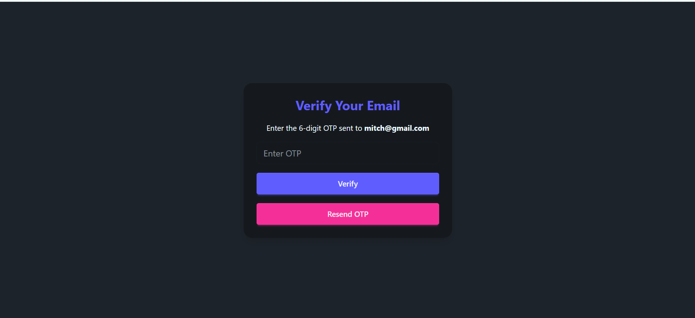

### 💞 Feed

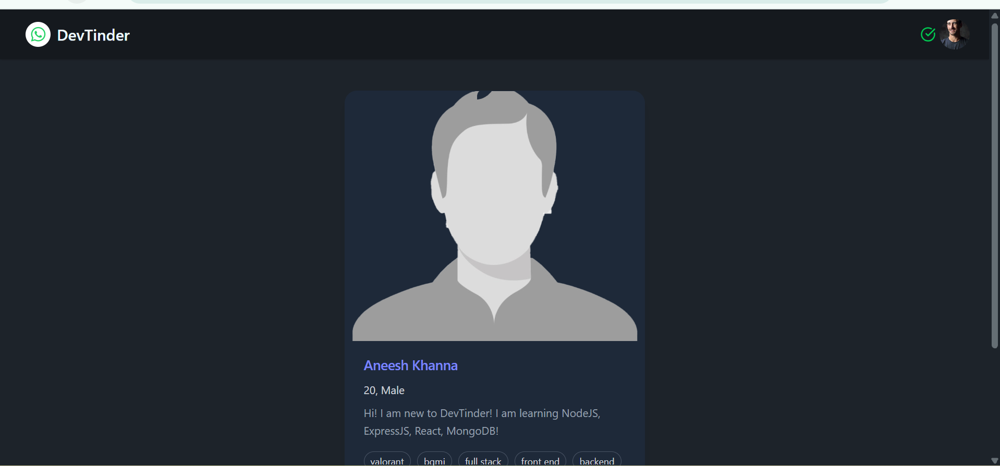
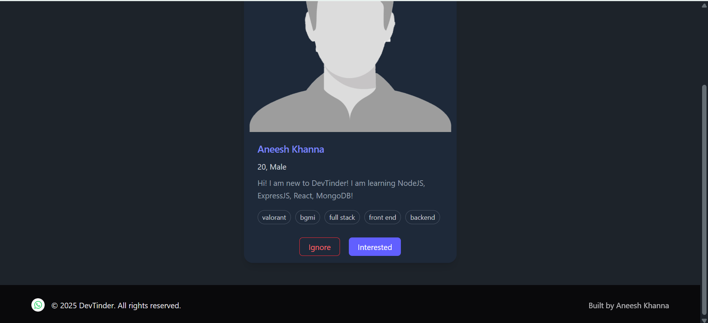
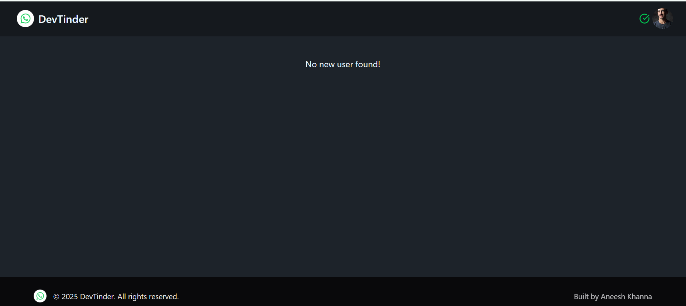

### ✨ Features

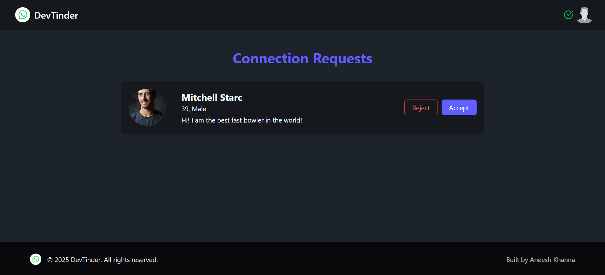
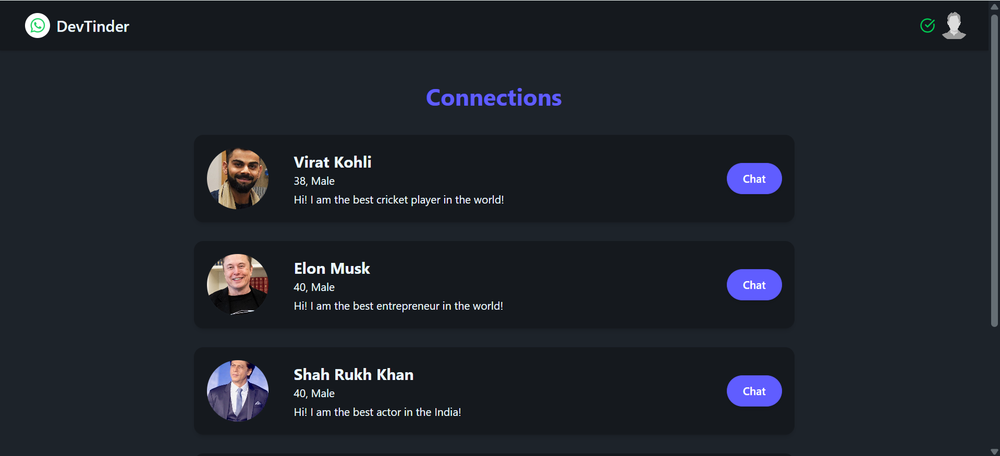
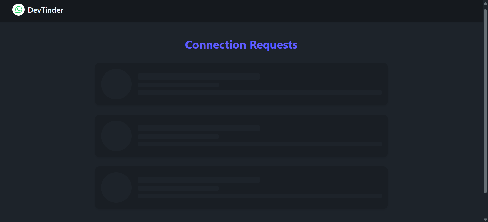
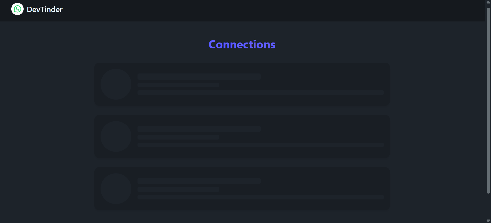

### ✏️ Profile Updation

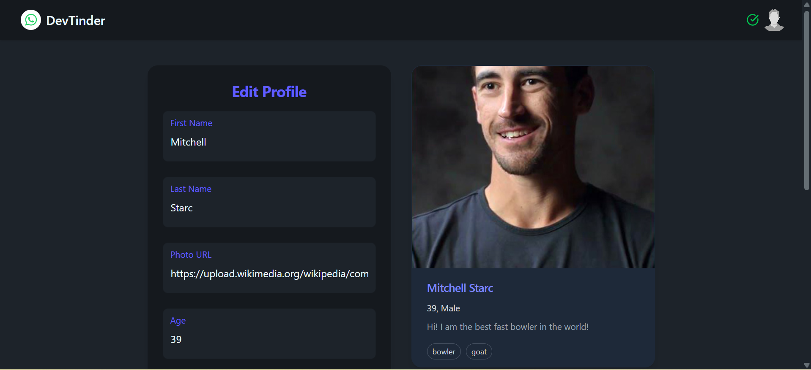
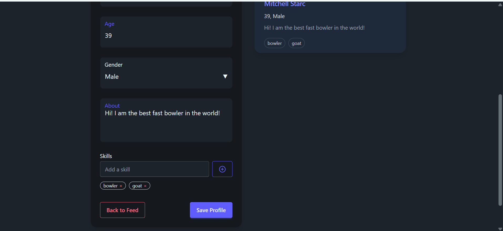
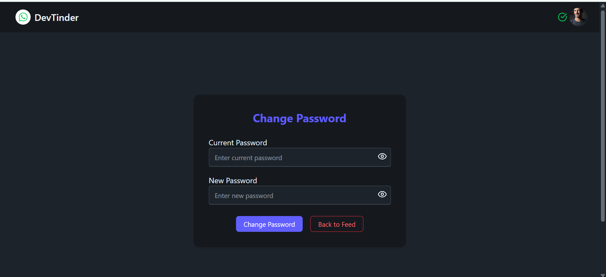

### 💬 Chat Window

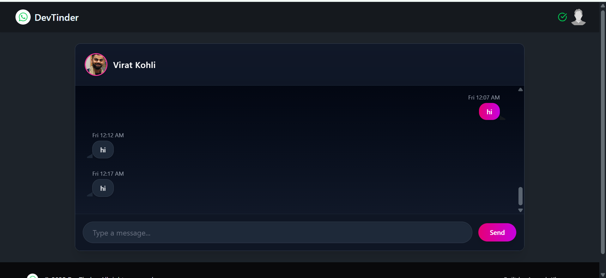

### 📄 Redux Store and Custom Offline Page

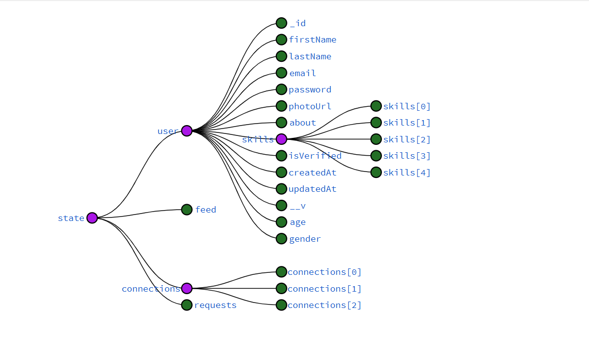
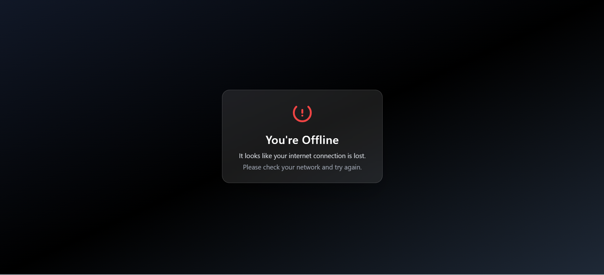

### 🧭 MongoDB

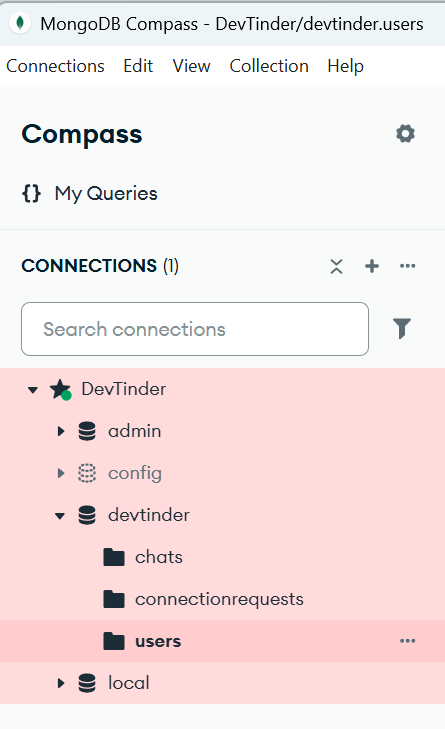

### 📮 Postman API's

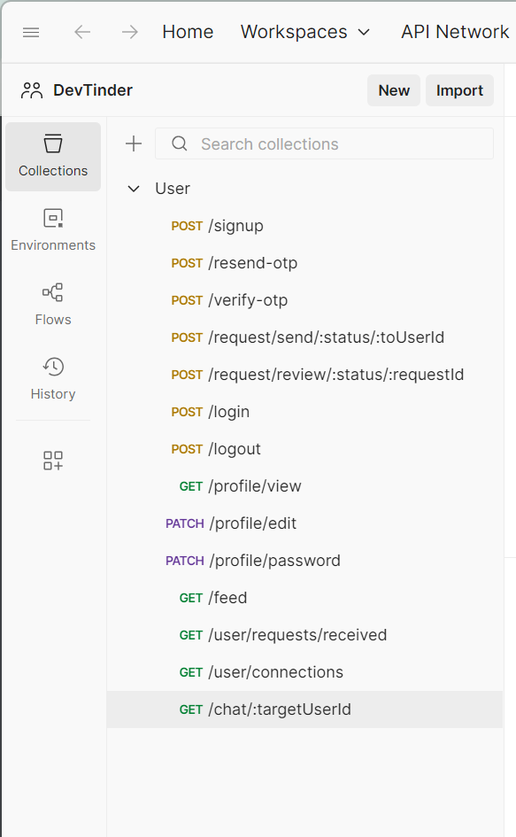

---

## 🧙 Security & Validation Highlights

- ✅ Passwords hashed using **bcrypt**
- ✅ JWT-based authentication middleware
- ✅ Only friends can chat (validated on backend)
- ✅ Input validation for all APIs
- ✅ Proper error handling + logging
- ✅ CORS restricted to frontend URL
- ✅ Helmet middleware for headers

---

## 🧾 Folder Structure

```bash
src/
├── config/
│   └── database.js
├── middlewares/
│   └── auth.js
├── models/
│   ├── user.js
│   ├── connectionRequest.js
│   └── chat.js
├── routes/
│   ├── auth.js
│   ├── chat.js
│   ├── request.js
│   ├── user.js
│   └── profile.js
├── utils/
│   ├── email.js
│   ├── socket.js
│   └── validation.js
└── app.js
└── constants.js

```

---

## 🧼 Deployment

- Deployed on **Render**
- UptimeRobot monitors the API health every 5 minutes to keep it awake
- `.env` variables managed via Render dashboard

---

## 📬 Contact

Built with ❤️ by **Aneesh Khanna**  
🖥️ [Frontend Repo →](https://github.com/Aneesh-Khanna/DevTinderWeb)
